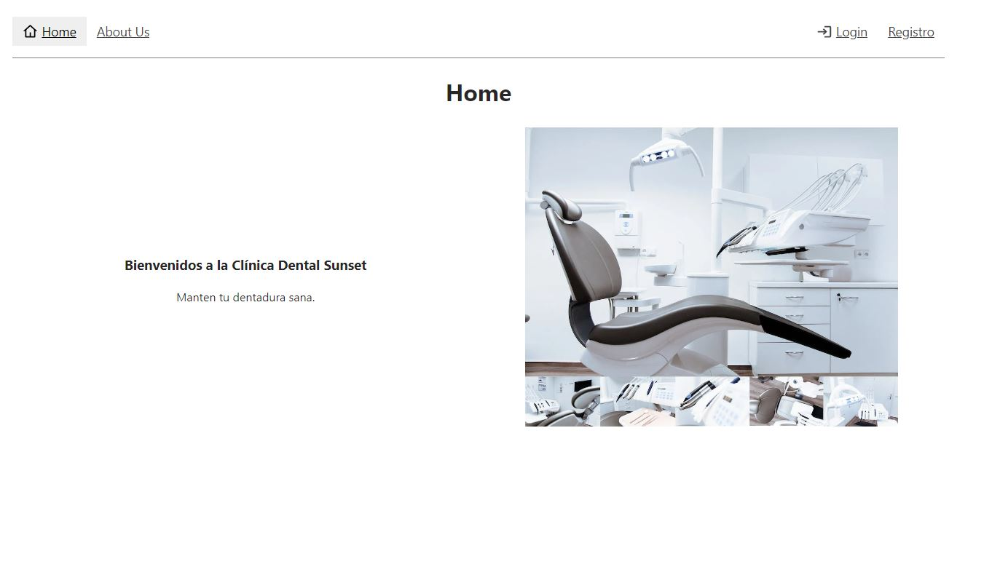
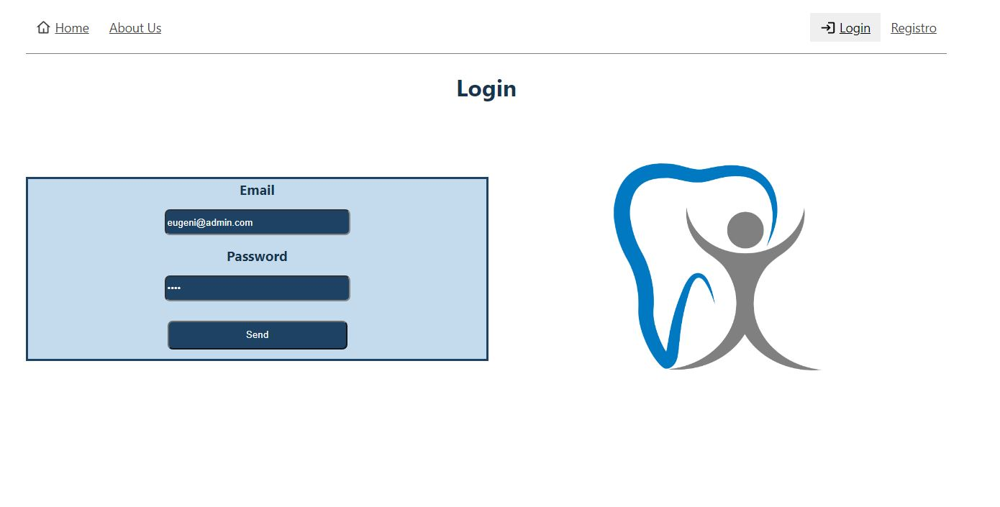
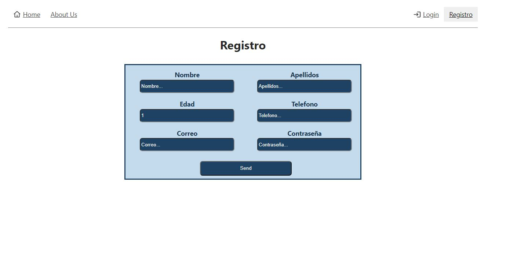
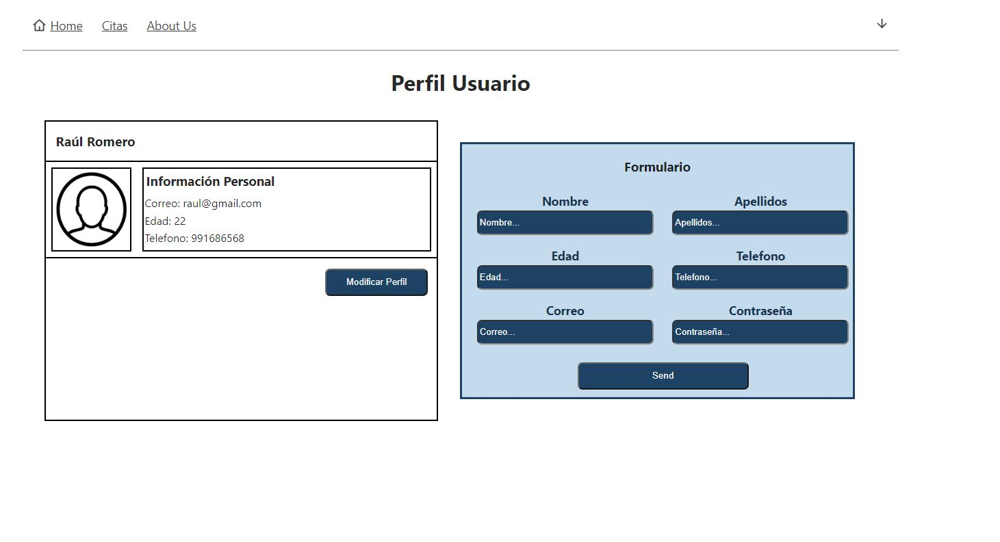
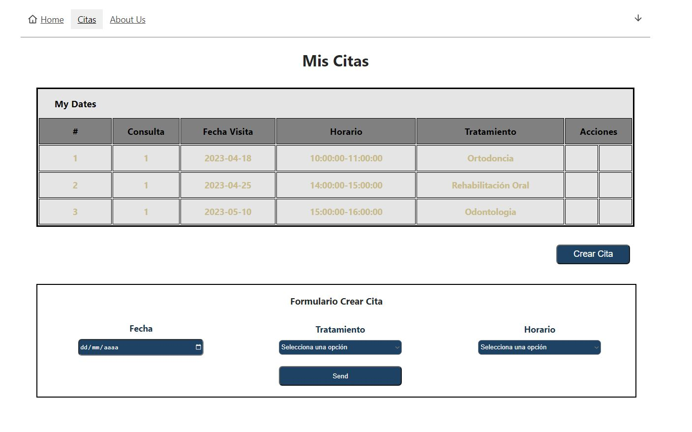
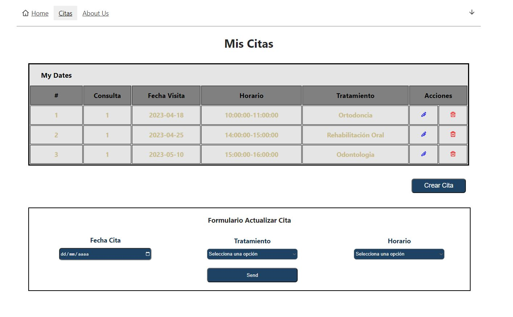

<h1 align="center">
   🦷 Dental Clinic Frontend 🦷
</h1>

---

- [About](#about)

- [Instructions](#instructions)

- [Screenshots](#images)

- [Tools](#tools)

---

## About :speech_balloon:

The purpose of this design is to recreate the frontend part of my Dental Clinic.

In this website you could register as a dentist or as a client and then login or logout.

As a dentist and patient you could see your profile, view your appointments or update your information.

If you are a client you could create a new appointment, modify or delete it.

And as an Admin you could see all the applications users (Patients and Admins).

## Instructions 📝

The first step is to clone the repository and install the project dependencies.

### `npm i`

Run the server.

### `npm run dev`

 

On the other side, you will need to clone the backend from [this repository](https://github.com/raulscz10/clinica-dental) and follow its instructions to run it.

## Screenshots 📸

Home

Login

Register form.

Profile

User Dates

Update User Dates

## Stack 🔧

 

